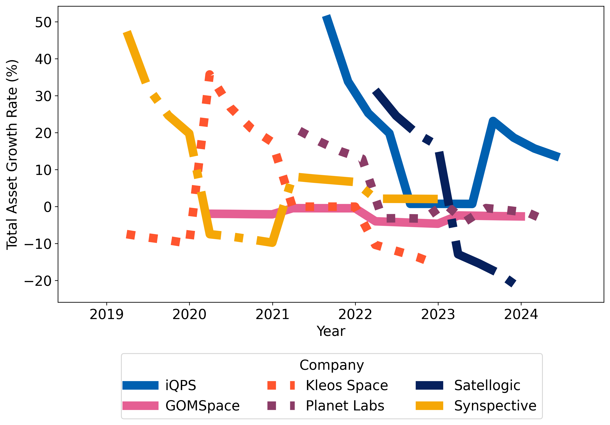
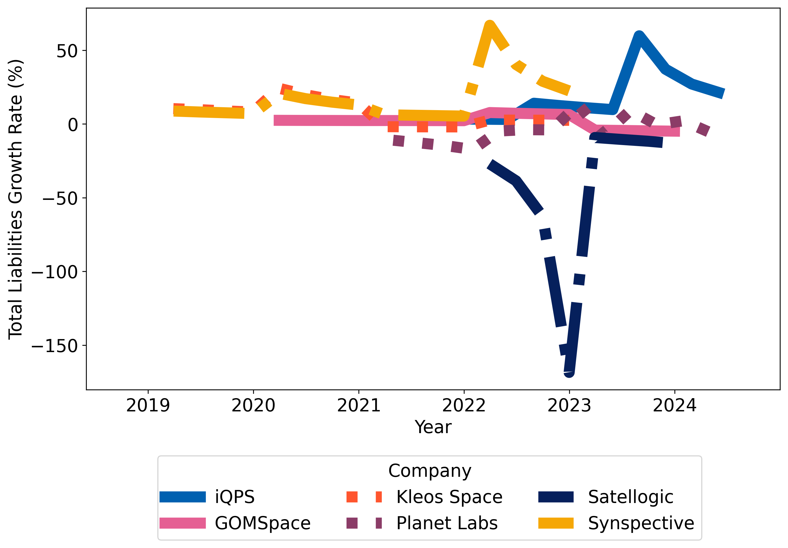

# Business Innovation in Commercial Space: Culture and Trends in Earth Observation

This repository contains the data and analysis code to support methods in our paper, *Business Innovation in Commercial Space: Culture and Trends in Earth Observation*, by Giulia Cambone*, Holly Dinkel*, Luca Ferrone*, Antonio Stark*, Shinsuke Kito*, Chawalwat Martkamjan*. This work was conducted within the framework of the 2024 International Astronautical Federation (IAF) International Programme/Project Management Committee (IPMC) Young Professionals' Workshop.

*Denotes equal contribution.

<p align="center">
  
  
  
</p>

## Dependencies

- pandas
- json
- matplotlib
- openpyxl

## Using Prepared Data

Clone the repository:

```bash
git clone git@github.com:hollydinkel/space_econometrics.git
```

To run the script and generate results on existing data in the repository, run:

```bash
python src/data_loading.py
```

## BibTex

```bash
@ARTICLE{
  iafipmc2024innovation,
  author={Cambone, Giulia and Dinkel, Holly and Ferrone, Luca and Kim, KangSan and Kito, Shinsuke and Martkamjan, Chawalwat},
  journal={IAF International Astronautical Congress}, 
  title={Business Innovation in Commercial Space: Culture and Trends in Earth Observation}, 
  year={2024},
  month={Oct.},
}
```